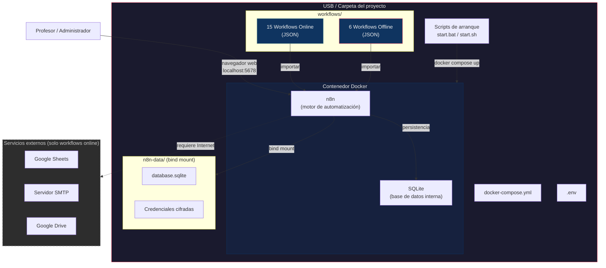
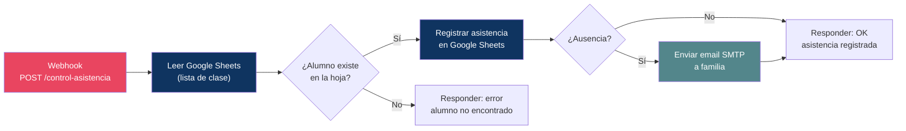
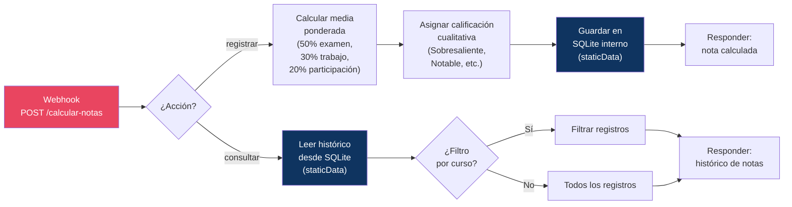
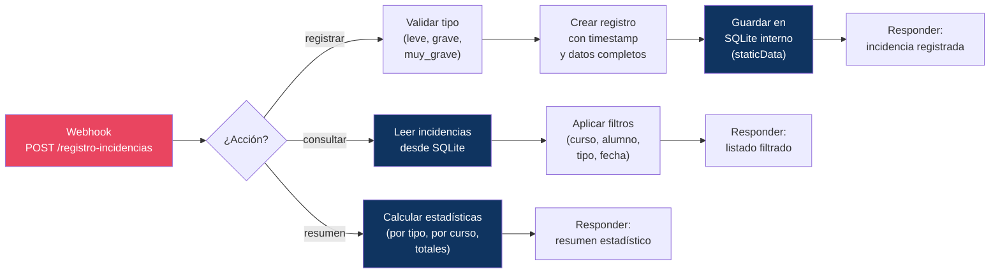
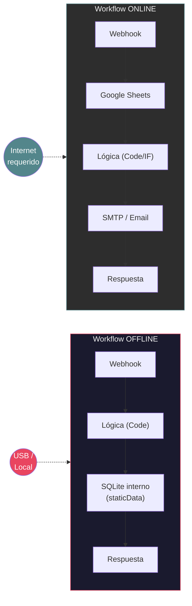

# Diagramas del Proyecto

> Diagramas técnicos en formato Mermaid. Para exportar a imagen, usar un renderizador Mermaid (mermaid.live, extensión de VS Code, etc.)

---

## 1. Arquitectura general del sistema

---

## 2. Flujo de un workflow online: Control de asistencia (04)

**Dependencias externas:** Google Sheets (lectura/escritura), SMTP (notificación)
**Requiere Internet:** Sí

---

## 3. Flujo de un workflow offline: Calculadora de notas (16)

**Dependencias externas:** Ninguna
**Requiere Internet:** No — todos los datos se almacenan en la base de datos SQLite interna de n8n

---

## 4. Flujo de un workflow offline: Registro de incidencias (17)

**Dependencias externas:** Ninguna
**Requiere Internet:** No

---

## 5. Comparativa visual: Online vs Offline

